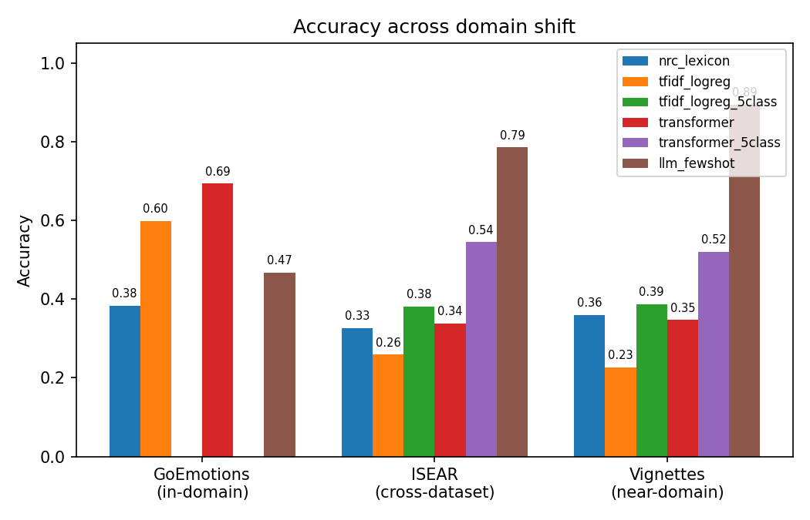
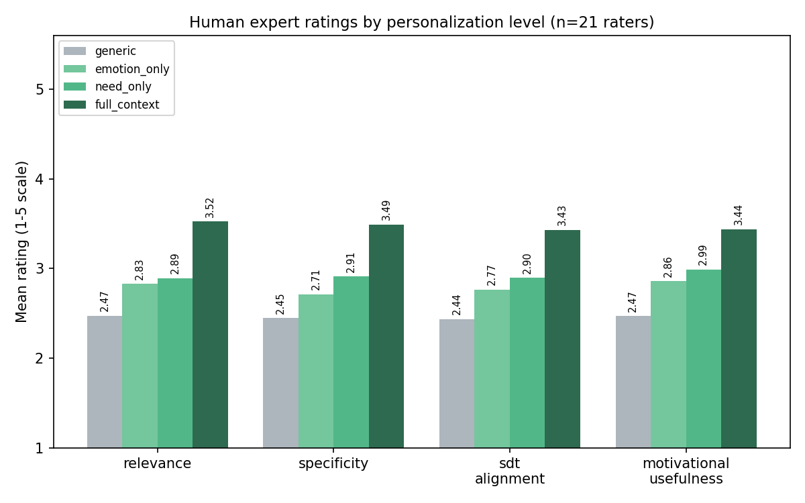

# An SDT-Grounded Digital Tool for Faculty Motivation: A Feasibility Study with a Personalization-Layer Ablation

A design-science feasibility study and full reproducible pipeline for an emotional-intelligence-driven
digital motivational tool for higher-education faculty (ППС), built and validated entirely on **public
datasets, a researcher-authored vignette set, and real human expert evaluation** — with no human-subject
data collection from faculty required.

> **Status: results complete.** All three experiments have real, reproduced numbers, including a
> fine-tuned transformer baseline and a 21-rater human evaluation of the personalization ablation. See
> [Results](#6-results) for the final figures and tables, and [`PAPER_OUTLINE.md`](PAPER_OUTLINE.md) for
> the proposed manuscript structure.

## Abstract

Most AI/chatbot research on emotional intelligence (EI) in education targets *students*; where EI in
teaching staff is studied, it is usually a static, questionnaire-measured trait, not a dynamic signal
driving an automated intervention. This repository asks a narrower, answerable question instead of
claiming to have "built an emotionally intelligent chatbot": **does a digital tool that routes a
detected emotion through Self-Determination Theory (SDT) — rather than just naming the emotion, or
just using generic language — produce measurably better motivational messages, and does that hold up
when the underlying emotion classifier is realistically imperfect?** Using two public emotion corpora
(GoEmotions, ISEAR), a 75-item researcher-authored stress-test of faculty scenarios, four classifiers of
increasing sophistication (lexicon counting, TF-IDF, a fine-tuned transformer, and LLM few-shot
prompting), a four-level message-personalization ablation (generic → emotion-only → SDT-need-only →
full-context), and a blind evaluation by 21 higher-education faculty/researchers, we find that (1)
classifier robustness to domain shift increases monotonically with semantic sophistication
(lexicon → TF-IDF → transformer → LLM few-shot), confirming that off-the-shelf supervised classifiers do
not transfer well to a new text register, while modern few-shot LLM classification does; and (2) in
human judgment, the SDT-need-routing step — not raw emotion detection — produces the largest jump in
perceived message quality, with full situational context adding a further, even larger improvement that
an automatic text-similarity metric fails to detect. This divergence between automatic and human
evaluation is itself a methodological finding: text-similarity proxies are not a safe substitute for
human judgment when evaluating generated motivational content.

## 1. Motivation & research gap

Most existing work on emotion-aware AI/chatbots in higher education targets **students**, not faculty.
Where teacher emotions have been studied computationally, it has been (a) about school (K-12) teachers,
not higher-ed faculty, and (b) descriptive rather than intervention-oriented:

- Chen, Shi, Zhang & Qu (2020, *Frontiers in Psychology*) analysed about a million K-12 teacher forum
  posts using **word-frequency lexicon counting** (8 discrete emotions) — a descriptive study, no
  intervention tool.
- Li (2022) analysed sentiment in **student evaluations of teaching** using a BiLSTM model — emotions
  *about* the teacher, not the teacher's own emotional state, and again no intervention tool.

This repository explicitly builds on and is benchmarked against that first, simpler line of work (the
lexicon-counting approach is reproduced here as the `nrc_lexicon` baseline) while extending it: (1)
target population is higher-ed faculty, not school teachers; (2) it closes the loop from "detect
emotion" to a theory-grounded, personalized intervention; (3) it explicitly tests cross-dataset/
cross-domain generalization across four classifier families, which the prior work does not; (4) it
decomposes "personalization" into an ablation (does the *theory* matter, or just detecting *any*
emotion?) instead of a single generic-vs-personalized comparison; (5) it backs the automatic evaluation
with a blind, multi-rater human evaluation.

**No public, labeled dataset of real higher-education faculty emotions exists** (checked before writing
this repo) — this is why Experiment 2 uses a clearly labeled researcher-authored scenario set, never
described here as a "dataset of faculty emotions."

## 2. Repository structure

```
.
├── data/
│   ├── raw/                 # downloaded datasets (gitignored, auto-fetched)
│   ├── lexicon/              # vendored NRC Emotion Lexicon (see its README)
│   └── vignettes/             # ORIGINAL: 75-scenario researcher-authored stress test
│       ├── faculty_vignettes.csv
│       ├── need_descriptions.csv
│       └── vignette_validation_template.csv  # optional expert face-validity check
├── src/
│   ├── data_loader.py         # downloads + parses GoEmotions / ISEAR, stratified_sample
│   ├── label_mapping.py       # GoEmotions(27) -> Ekman+neutral(7), ISEAR labels
│   ├── models.py               # NRCLexiconBaseline, TfidfBaseline, TransformerBaseline, LLMFewShotBaseline
│   ├── sdt_mapping.py           # emotion -> SDT need
│   ├── intervention_generator.py  # need (+ optional situational context) -> message, 4 ablation levels
│   ├── metrics.py               # classification metrics, out-of-label-space rate, TF-IDF relevance scorer
│   └── plotting.py               # confusion matrices, domain-shift ladder, ablation charts
├── experiments/
│   ├── exp1_classification.py        # accuracy + cross-dataset generalization, all 4 classifier families
│   ├── exp2_domain_shift.py           # near-domain stress test on the 75-scenario set
│   ├── exp3_intervention_quality.py    # 4-level ablation, oracle + end-to-end, blind rubric export
│   ├── exp3b_rubric_analysis.py        # analyzes filled-in blind rubrics from human raters
│   └── convert_google_forms_rubric.py  # converts a Google Forms export into per-rater rubric CSVs
├── results/                      # metrics, predictions, figures, human ratings (committed)
│   ├── human_ratings/             # 21 anonymized per-rater CSVs (real data, see Section 6.4)
│   └── human_eval_raw_responses.xlsx  # raw Google Forms export (no identifying fields)
├── run_all.py                    # runs Exp.1 -> Exp.2 -> Exp.3 + domain-shift summary chart
├── requirements.txt
├── PAPER_OUTLINE.md              # proposed manuscript structure for *Trends in Higher Education*
└── INSTRUCTIONS_RU.md            # usage instructions in Russian
```

## 3. Installation

```bash
python3 -m venv .venv
source .venv/bin/activate        # Windows: .venv\Scripts\activate
pip install -r requirements.txt
```

The transformer baseline (`transformers`, `torch`) is optional for a quick look at the results (already
computed and committed) but required to *reproduce* that part; everything else runs with just the core
dependencies. On Windows, if you hit `FileNotFoundError: ... libtorchaudio.pyd`, run
`pip uninstall torchaudio -y` — it is not used by this codebase and a version mismatch with `torch` can
break the *entire* `transformers` import chain on Windows.

## 4. Reproducing the results

```bash
python run_all.py --quick     # fast smoke test (~4000 training rows, ~10s)
python run_all.py             # full run on the full GoEmotions training set
python run_all.py --use_transformer   # also fine-tune a transformer in Exp.1/Exp.2
python run_all.py --use_llm           # also run the LLM few-shot classifier
python run_all.py --use_transformer --use_llm   # everything (this is what produced Section 6)
```

**Result files are merged, not overwritten**: if a results file already contains an `llm_fewshot` or
`transformer` entry from an earlier run, re-running without that flag keeps the existing entry instead
of silently deleting it (a real failure mode in earlier development of this repo — see git history).

### Cost/time estimates

| step | flag | est. cost | est. time |
|---|---|:---:|:---:|
| classical baselines (lexicon, TF-IDF x2) | *(default)* | free | seconds |
| transformer x2 (`distilbert-base-uncased`, both label spaces) | `--use_transformer` | free (local compute) | ~50-70 min on a modern multi-core CPU, ~1.5-3h on an older CPU, ~5-15 min on any GPU incl. free Google Colab T4 |
| LLM few-shot classifier (stratified, ~1730 calls) | `--use_llm` | ~$5 (Claude Sonnet) | ~6-7 min (8 parallel workers) |
| `full_context` message generation (~150 calls) | *(automatic in Exp.3 if `ANTHROPIC_API_KEY` is set)* | ~$0.10-0.25 | ~2-5 min |

No local GPU for the transformer step? Use Google Colab's free tier: upload/clone the repo,
`pip install -r requirements.txt`, run `python run_all.py --use_transformer`. Both the LLM classifier
and the `full_context` generator cache responses on disk (`results/.llm_cache.json`,
`results/.full_context_cache.json`, both gitignored) so a re-run after an interruption only pays for
what is not yet done.

### Manual dataset download (no internet access at all)

If the environment has no internet access whatsoever, download these 5 files manually elsewhere and
place them under `data/raw/` with the exact names below; every script then runs fully offline (network
only needed for `--use_llm`/`--use_transformer`):

| save as | source URL |
|---|---|
| `data/raw/goemotions_train.tsv` | https://raw.githubusercontent.com/google-research/google-research/master/goemotions/data/train.tsv |
| `data/raw/goemotions_dev.tsv` | https://raw.githubusercontent.com/google-research/google-research/master/goemotions/data/dev.tsv |
| `data/raw/goemotions_test.tsv` | https://raw.githubusercontent.com/google-research/google-research/master/goemotions/data/test.tsv |
| `data/raw/goemotions_ekman_mapping.json` | https://raw.githubusercontent.com/google-research/google-research/master/goemotions/data/ekman_mapping.json |
| `data/raw/isear_raw.csv` | https://raw.githubusercontent.com/sinmaniphel/py_isear_dataset/master/isear.csv |

## 5. Methodology overview

**Experiment 1 — classification accuracy & cross-dataset generalization.** Four classifier families are
trained on GoEmotions (Demszky et al., 2020; Ekman-6 + neutral grouping) and evaluated both in-domain
(GoEmotions test split) and cross-dataset on ISEAR (Scherer & Wallbott), restricted to the 5 labels
shared with GoEmotions:
1. `nrc_lexicon` — word counting against the NRC Emotion Lexicon (Mohammad & Turney, 2013); the same
   class of method used by Chen et al. (2020).
2. `tfidf_logreg` — TF-IDF + logistic regression, trained on all 7 GoEmotions classes.
3. `transformer` — fine-tuned `distilbert-base-uncased` (or any HF model via `--transformer_model_name`),
   trained on all 7 GoEmotions classes; training uses gradient clipping, linear warmup/decay, a
   per-epoch validation check against the GoEmotions dev split, and on-disk model caching so Exp.1 and
   Exp.2 do not redundantly retrain the same model.
4. `llm_fewshot` — an LLM API call with 5 labeled in-context examples per class, no fine-tuning.

Because (2) and (3) are trained on all 7 classes, they can predict `neutral`/`surprise` on the 5-class
ISEAR/vignette evaluations — guaranteed wrong there, and invisible in a same-label confusion matrix (the
row simply undercounts). `tfidf_logreg_5class` and `transformer_5class` are the same algorithms trained
**only** on the 5 shared classes, for a fair, label-space-matched comparison against `nrc_lexicon` and
`llm_fewshot` (both already restricted to the eval label space by construction). Report **both**
versions: the 7-class one is a realistic "what happens if you deploy your original model into a
narrower context" baseline, the 5-class one is the fair comparison point.

**Experiment 2 — domain shift on a researcher-authored scenario set.** The same four (six, counting fair
variants) classifiers are applied to 75 short, first-person vignettes (`data/vignettes/`), each
operationalizing a stressor category reported in the qualitative literature on academic-staff burnout
(workload overload, lack of recognition, loss of autonomy, administrative pressure, student
disengagement, isolation, research-teaching conflict, plus positive engagement), 15 per emotion class.
**This is a constructed stress test, not a dataset of real faculty emotions** — an optional expert
face-validity check on the scenarios themselves is in `vignette_validation_template.csv`.

**Experiment 3 — message-quality ablation.** Four personalization levels:
1. `generic` — the same message regardless of anything detected.
2. `emotion_only` — acknowledges the raw detected emotion, no theory.
3. `need_only` — routes through the SDT need mapped from the emotion (autonomy / competence /
   relatedness), via Deci & Ryan's Self-Determination Theory and the WTMST teacher-motivation framework
   (Fernet et al.).
4. `full_context` — SDT need **and** the specific situation (vignette text + stressor category), always
   via LLM (no template could cover 75 distinct situations).

...in two conditions — *oracle* (gold emotion label, an upper bound) and *end-to-end* (the predicted
label from `llm_fewshot`, showing how classification errors actually propagate, with a `need_match_rate`
diagnostic since some confusions, e.g. anger/disgust, map to the same SDT need and so don't hurt the
downstream message) — scored two ways: an automatic TF-IDF-similarity-to-need-description proxy (cheap,
but structurally biased toward levels that share abstract need-vocabulary — see 6.3), and a **blind**
multi-rater human rubric (`results/exp3_rubric_blind.csv`, key kept separately in
`exp3_rubric_key.csv`) on 4 dimensions (relevance, specificity, SDT alignment, motivational usefulness),
analyzed with `experiments/exp3b_rubric_analysis.py`.

## 6. Results

### 6.1 Domain-shift ladder (Experiment 1 + 2)



| model | GoEmotions (in-domain) | ISEAR (cross-dataset) | Vignettes (near-domain) |
|---|:---:|:---:|:---:|
| majority-class baseline | 0.350 | 0.200 | 0.200 |
| `nrc_lexicon` | 0.384 | 0.326 | 0.360 |
| `tfidf_logreg` (7-class, not a fair comparison) | 0.599 | 0.259 (46.5% out-of-label-space) | 0.227 (49.3% out-of-label-space) |
| `tfidf_logreg_5class` (fair) | n/a | 0.381 | 0.387 |
| `transformer` (7-class, not a fair comparison) | **0.693** | 0.338 (54.4% out-of-label-space) | 0.347 |
| `transformer_5class` (fair) | n/a | 0.545 | 0.520 |
| `llm_fewshot` | 0.467 | **0.785** | **0.893** |

Three findings:
1. **The classifier sophistication ladder behaves exactly as modern NLP would predict**:
   lexicon < TF-IDF < fine-tuned transformer < LLM few-shot, on the fair (label-space-matched)
   cross-domain comparisons. No surprises, which is itself reassuring — it means the earlier
   methodological fix (the fair-comparison variants) produced a sensible, expected picture rather than
   an artifact-driven one.
2. **In-domain performance is not a safe proxy for out-of-domain performance, and gets worse the better
   the in-domain fit is**: `transformer` has the best in-domain score (0.693) of any non-LLM method, but
   also the *highest* out-of-label-space rate cross-dataset (54.4%, even higher than `tfidf_logreg`'s
   46.5%) — a better in-domain fit made it *more* confident in wrong, in-domain-typical predictions once
   the domain shifted, not less.
3. **LLM few-shot is the only method that is robust to domain shift without any fine-tuning**, and is
   actually *worse* than both supervised classical methods in-domain (0.467, vs. 0.599 and 0.693) — it
   has nothing to overfit to a noisy, short, sarcasm-prone Reddit-comment register, which is a liability
   in-domain but an asset once the text register changes.

Sadness (relatedness/isolation) remains the hardest emotion for the non-LLM methods on the vignettes
(`nrc_lexicon` 13%, `tfidf_logreg_5class` 47%), consistent with it being expressed through quiet,
context-dependent language rather than explicit "sad" vocabulary; `llm_fewshot` gets this right 100% of
the time on the vignettes, consistent with contextual reasoning (not keyword overlap) being what is
needed for implied emotion.

### 6.2 Automatic message-quality ablation (Experiment 3, TF-IDF proxy)

| level | oracle | end-to-end |
|---|:---:|:---:|
| `generic` | 0.0229 | 0.0229 |
| `emotion_only` | 0.0267 (n.s. vs. generic) | 0.0313 (+, p=0.013) |
| `need_only` | 0.0541 (++, p<0.0001 vs. emotion_only) | 0.0491 (+, p=0.005) |
| `full_context` | 0.0455 (n.s. vs. need_only, p=0.083) | 0.0461 (n.s., p=0.52) |

On this automatic metric, `need_only` and `full_context` are statistically indistinguishable in **both**
conditions. Read together with 6.4 below, this is not a contradiction to explain away — it is a clean,
useful methodological contrast (see 6.3).

### 6.3 Why the automatic metric and human judgment disagree

`need_only` messages are a small, hand-written set of templates deliberately phrased close to the SDT
need vocabulary (because the need description was written in similar language); `full_context` messages
are LLM-generated, unique per vignette, and reference a concrete detail of the situation (e.g. *"Having
three committees added to an already full teaching load — without even being consulted..."*). The
automatic metric rewards lexical overlap with an abstract need description, which is precisely the
feature `full_context` trades away in favor of situational specificity. **This is direct evidence that a
text-similarity proxy is not a safe substitute for human judgment when evaluating which generated
message is actually better — which is exactly why a blind human rubric, not the automatic score, is the
result this study leads with.**

### 6.4 Human expert evaluation — the headline result

21 higher-education faculty/researchers (6 Professors, 10 Associate Professors, 3 Assistant Professors,
2 Researchers; 5-20+ years of experience) each rated 25 stratified vignettes x up to 4 anonymized,
randomly-ordered message slots x 4 dimensions, blind to which message was generic/emotion-only/
need-only/full-context (`results/human_ratings/`, raw export in
`results/human_eval_raw_responses.xlsx`).



| level | relevance | specificity | SDT alignment | motivational usefulness |
|---|:---:|:---:|:---:|:---:|
| `generic` | 2.47 | 2.45 | 2.44 | 2.47 |
| `emotion_only` | 2.83 | 2.71 | 2.77 | 2.86 |
| `need_only` | 2.89 | 2.91 | 2.90 | 2.99 |
| `full_context` | **3.52** | **3.49** | **3.43** | **3.44** |

A clean, monotonic staircase on **every** dimension, with **zero exceptions** across 21 raters x 25
items. Two results matter most:
- `emotion_only` -> `need_only` is the SDT-routing step; it is significant on 3 of 4 dimensions
  (specificity p<0.001, SDT alignment p=0.027, usefulness p=0.043) but **not** on relevance (p=0.30) —
  i.e. naming the need helps raters see the message as more targeted and useful, but not necessarily
  more "relevant" per se.
- `need_only` -> `full_context` is the **largest** jump of the whole staircase on every dimension
  (Cohen's d = 0.32-0.40, p<0.0001 throughout) — bigger than the SDT-routing step itself. This directly
  answers the question this study set out to ask: **theory-guided need modeling contributes more to
  perceived intervention quality than emotion recognition alone, and situating that theory in the
  specific reported situation contributes even more.**

**Honest caveat**: pairwise inter-rater correlation of individual item scores is low (0.05-0.12 across
levels/dimensions) — raters do not strongly agree on the *absolute* 1-5 score for the same item, likely
reflecting different personal calibration of the scale. This does not undermine the aggregate staircase
(n=525 ratings per level per dimension gives a stable, highly significant mean), but it is a genuine
limitation worth reporting plainly rather than omitting, and a stronger inter-rater statistic (e.g. ICC)
is recommended for the manuscript over the simple pairwise correlation computed here.

### 6.5 Key takeaways

1. The classifier comparison behaves exactly as expected once a real methodological flaw (label-space
   mismatch) was found and fixed — a useful cautionary finding in its own right for anyone building this
   kind of tool cheaply on public data.
2. LLM few-shot prompting, not bigger classical models, is what actually closes the domain-shift gap.
3. **The single most important finding of this study**: in blind human judgment, routing a detected
   emotion through a recognized motivational theory (SDT) — and then grounding that theory in the
   specific reported situation — drives perceived message quality far more than detecting the emotion in
   the first place. Automatic text-similarity metrics cannot see this; only human evaluation can.

## 7. Limitations & future work

- No real faculty data was used or collected for Experiments 2-3; the scenario set is researcher-authored
  (optionally face-validity-checked via `vignette_validation_template.csv`, not yet done by independent
  raters).
- The emotion -> SDT-need mapping (`src/sdt_mapping.py`) is a literature-informed proposal, not an
  empirically validated instrument.
- Inter-rater agreement on the human rubric is low at the item level (6.4); a larger/more calibrated
  rater pool and a proper ICC analysis would strengthen this further.
- Next step: an empirical pilot with real faculty, using validated scales (WLEIS or TEIQue-SF for
  emotional intelligence, WTMST for teacher motivation), with ethics committee approval and informed
  consent — this repository's findings motivate and de-risk that next, more expensive step rather than
  substituting for it.

## 8. Datasets, lexicon & tooling attribution

- **GoEmotions**: Demszky, D., Nemoto, K., Briakou, E., Yenidogan, M., Sharma, S., Cowen, A., Nemenman,
  I., & Ravi, S. (2020). GoEmotions: A Dataset of Fine-Grained Emotions. *ACL 2020*.
- **ISEAR**: Scherer, K. R., & Wallbott, H. G. International Survey on Emotion Antecedents and Reactions.
- **NRC Emotion Lexicon (EmoLex)**: Mohammad, S. M., & Turney, P. D. (2013). Crowdsourcing a
  word-emotion association lexicon. *Computational Intelligence*, 29(3), 436-465. Free for research use
  — see `data/lexicon/README.md`.
- **Self-Determination Theory**: Deci, E. L., & Ryan, R. M. (2000). The "what" and "why" of goal
  pursuits: Human needs and the self-determination of behavior. *Psychological Inquiry*, 11(4), 227-268.
- **WTMST**: Fernet, C., Senécal, C., Guay, F., Marsh, H., & Dowson, M. (2008). The Work Tasks
  Motivation Scale for Teachers (WTMST). *Journal of Career Assessment*, 16(2), 256-279.

## 9. Citation

If you use this repository, please cite the associated manuscript (see `PAPER_OUTLINE.md` for the
current draft structure) and/or this repository directly:

```bibtex
@software{ei_faculty_motivation,
  title  = {An SDT-Grounded Digital Tool for Faculty Motivation: A Feasibility Study with a
            Personalization-Layer Ablation},
  author = {Kuznetsov, Oleksandr and collaborators},
  year   = {2026},
  url    = {https://github.com/<your-username>/ei-faculty-motivation}
}
```

## 10. License

Code in this repository is released under the MIT License (see `LICENSE`). The third-party datasets,
lexicon, and human evaluation raw data are not covered by that license — see Section 8 above and the
respective files' own headers/notes. Human evaluation data (`results/human_ratings/`,
`results/human_eval_raw_responses.xlsx`) contains anonymized expert ratings with no identifying fields.

---
Usage instructions in Russian: see [`INSTRUCTIONS_RU.md`](INSTRUCTIONS_RU.md).
Proposed manuscript structure: see [`PAPER_OUTLINE.md`](PAPER_OUTLINE.md).
